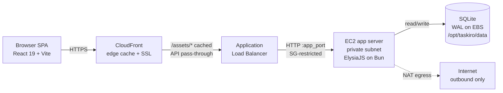
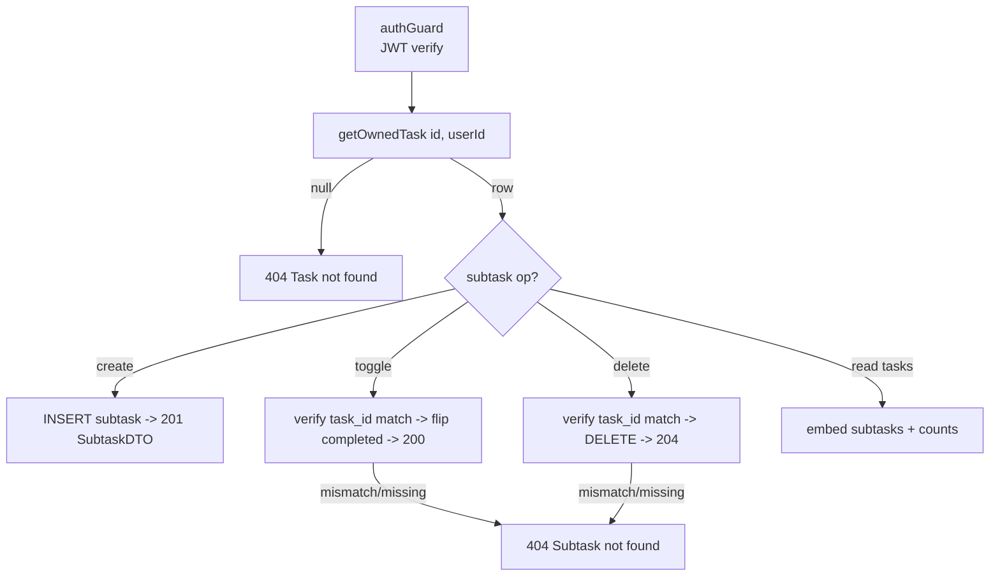
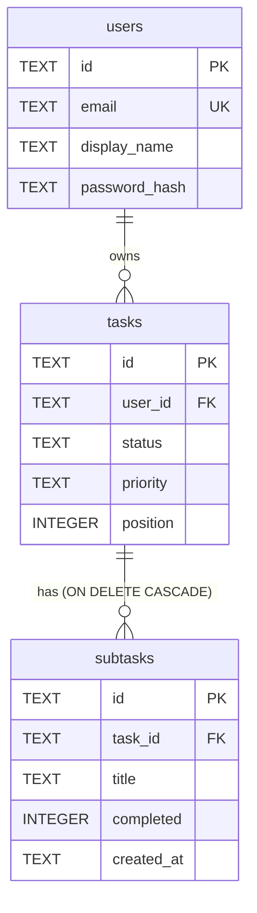

# Design Document: Subtasks & Hardening

## Overview

TasKiro is a cyberpunk-themed Kanban board (React 19 SPA + ElysiaJS-on-Bun REST API + `bun:sqlite`, deployed CloudFront → ALB → private EC2 → SQLite on EBS). This spec has two purposes:

1. **Document the as-built subtasks feature** as the design of record. A per-task subtask checklist — table, DTOs, three owner-scoped endpoints, embedded counts, and the full frontend UI — is **already implemented and verified in the codebase**. This document describes the system as it actually exists so that the working implementation is not churned.
2. **Specify two remaining hardening gaps** that are the actual new work driven by this spec:
   - **GAP 1 — SQLite durability/concurrency pragmas** in `backend/src/db.ts`.
   - **GAP 2 — CloudFront managed cache policies** in `infra/terraform/envs/dev/compute.tf`, retiring the deprecated `forwarded_values` blocks.

Both gaps come directly from the real-time architectural audit recorded in [ADR 0001, Audit Addendum (2026-08-26)](../../../docs/adr/0001-ai-agent-finops-governance.md) and are constrained by [`.kiro/steering/aws-standards.md`](../../steering/aws-standards.md).

> **Field-naming reconciliation.** The original loose request referred to `total_subtasks` / `completed_subtasks`. The **actual implemented and frontend-consumed** field names are camelCase `subtaskTotal` / `subtaskCompleted`. This document uses the real names throughout. No renaming is proposed — the working contract is authoritative.

---

## Architecture

### High-Level Architecture

#### Request Flow Architecture



- **CloudFront** terminates TLS and caches static assets at the edge. API traffic (default behavior) must not be cached and must forward auth/cookies/query to the ALB origin. GAP 2 corrects how this is expressed.
- **ALB** is the only ingress to compute; its security group is the sole source EC2 accepts traffic from.
- **EC2** runs the ElysiaJS API on Bun, has no public IP, and reaches the internet only via NAT.
- **SQLite on EBS** is the single-writer datastore. WAL mode is set; GAP 1 adds the durability/concurrency pragmas the audit recommends.

#### Where Subtasks Fit

Subtasks are a child entity of `tasks` (one-to-many, `ON DELETE CASCADE`). They never widen the trust boundary: every subtask endpoint runs behind the same `authGuard` and is scoped through the owned parent task. The API embeds each task's subtasks plus two derived counts (`subtaskTotal`, `subtaskCompleted`) in every task response, so the board renders progress without extra round-trips.



---

## Components and Interfaces

### Backend modules

| Module | Responsibility |
| --- | --- |
| `backend/src/db.ts` | Opens the `bun:sqlite` database on the EBS path, sets connection pragmas, and creates the schema (`users`, `tasks`, `subtasks` + indexes). **GAP 1 lives here.** |
| `backend/src/types.ts` | Row types (`UserRow`, `TaskRow`, `SubtaskRow`), public DTOs (`TaskDTO`, `SubtaskDTO`), and mappers `toSubtaskDTO` / `toTaskDTO`. `toTaskDTO(row, subtasks=[])` derives `subtaskTotal` and `subtaskCompleted`. |
| `backend/src/tasks.ts` | Elysia route group `prefix: "/tasks"` behind `authGuard`. Task CRUD + Kanban status move, plus the three subtask endpoints. Helpers `getOwnedTask(id, userId)` and `getSubtasks(taskId)` enforce ownership and load children ordered by `created_at`. |

### Frontend components & prop contracts

| Component | Role | Key contract |
| --- | --- | --- |
| `types/task.ts` | Type mirror of backend DTOs. | `Subtask { id, taskId, title, completed, createdAt }`; `Task` extended with `subtasks: Subtask[]`, `subtaskTotal: number`, `subtaskCompleted: number`. |
| `lib/api.ts` | Typed fetch client (JWT bearer, 204 handling, `ApiError`). | `addSubtask(taskId, title) → Subtask`; `toggleSubtask(taskId, subtaskId) → Subtask`; `deleteSubtask(taskId, subtaskId) → void`. |
| `components/TaskCard.tsx` | Renders a task card. | Shows `"{subtaskCompleted} of {subtaskTotal} subtasks completed"` and a cyan→magenta gradient progress bar with glow **only when `subtaskTotal > 0`**. Width = `subtaskCompleted / subtaskTotal * 100%`. |
| `components/EditTaskModal.tsx` | Task edit form + subtask checklist. | Add (input + Enter or button), toggle (checkbox), delete (✕). Per-row in-flight guard via `pendingSubtaskIds: Set<string>`; inline `subtaskError`. Mutates subtasks immediately against the API, independent of Save. Calls `onSubtasksChanged(taskId, subtasks)` after each change. Returns `null` when `!open \|\| !task` (unmounts on close). Backdrop is a sibling `<button>` of the panel — no trapped pointer events. |
| `components/Dashboard.tsx` | Board state owner. | `handleSubtasksChanged(taskId, subtasks)` recomputes `subtaskTotal`/`subtaskCompleted` and patches task state in place (callback approach, **no refetch**). Passes `onSubtasksChanged` into `EditTaskModal`. |

**Prop contract — `EditTaskModal`:**

```typescript
interface EditTaskModalProps {
  open: boolean;
  task: Task | null;
  onClose: () => void;
  onSave: (id: string, patch: {
    title: string; description: string; priority: Priority;
    tags: string[]; assignee: string;
  }) => Promise<void> | void;
  onSubtasksChanged?: (taskId: string, subtasks: Subtask[]) => void;
}
```

---

## Data Models

### Schema (as-built)

```sql
CREATE TABLE IF NOT EXISTS users (
  id            TEXT PRIMARY KEY,
  email         TEXT NOT NULL UNIQUE,
  display_name  TEXT NOT NULL,
  password_hash TEXT NOT NULL,
  created_at    TEXT NOT NULL DEFAULT (datetime('now'))
);

CREATE TABLE IF NOT EXISTS tasks (
  id          TEXT PRIMARY KEY,
  user_id     TEXT NOT NULL,
  title       TEXT NOT NULL,
  description TEXT NOT NULL DEFAULT '',
  status      TEXT NOT NULL DEFAULT 'todo'
                CHECK (status IN ('todo','in-progress','done')),
  priority    TEXT NOT NULL DEFAULT 'medium'
                CHECK (priority IN ('low','medium','high','critical')),
  tags        TEXT NOT NULL DEFAULT '[]',   -- JSON-encoded string[]
  assignee    TEXT NOT NULL DEFAULT '',
  position    INTEGER NOT NULL DEFAULT 0,
  created_at  TEXT NOT NULL DEFAULT (datetime('now')),
  updated_at  TEXT NOT NULL DEFAULT (datetime('now')),
  FOREIGN KEY (user_id) REFERENCES users(id) ON DELETE CASCADE
);
CREATE INDEX IF NOT EXISTS idx_tasks_user ON tasks(user_id, status, position);

CREATE TABLE IF NOT EXISTS subtasks (
  id         TEXT PRIMARY KEY,
  task_id    TEXT NOT NULL,
  title      TEXT NOT NULL,
  completed  INTEGER NOT NULL DEFAULT 0,   -- 0/1 boolean
  created_at TEXT NOT NULL DEFAULT (datetime('now')),
  FOREIGN KEY (task_id) REFERENCES tasks(id) ON DELETE CASCADE
);
CREATE INDEX IF NOT EXISTS idx_subtasks_task ON subtasks(task_id);
```



> **Cascade note.** `ON DELETE CASCADE` on `subtasks.task_id` is only honored because `PRAGMA foreign_keys = ON` is set at connection open. GAP 1 preserves this and adds durability/concurrency pragmas alongside it.

### DTO mapping (as-built)

```typescript
// SubtaskRow (DB)                    // SubtaskDTO (API/UI)
{ id, task_id, title,        →        { id, taskId, title,
  completed: number,                    completed: boolean,   // completed === 1
  created_at }                          createdAt }

// TaskDTO carries children + derived counts:
subtasks: SubtaskDTO[]
subtaskTotal:     subtasks.length
subtaskCompleted: subtasks.filter(s => s.completed).length
```

Validation rules: `title` is `t.String({ minLength: 1 })` and trimmed server-side; `completed` is a 0/1 integer surfaced as a boolean; counts are always derived, never stored.

---

## API Route Contracts

All routes are under `prefix: "/tasks"`, behind `authGuard` (JWT bearer). `user` is the authenticated principal; ownership is enforced by `getOwnedTask(id, user.id)`. Errors return JSON `{ "error": string }` with the status codes below.

### Subtask endpoints (as-built)

#### POST `/tasks/:id/subtasks` — create a subtask

- **Auth:** required.
- **Path:** `:id` = parent task id.
- **Request body:** `{ "title": string }` (minLength 1, trimmed).
- **Responses:**
  - `201` → `SubtaskDTO`
  - `400` → validation error (empty/missing title)
  - `401` → missing/invalid JWT
  - `404` `{ "error": "Task not found" }` → parent not owned by caller

#### PATCH `/tasks/:id/subtasks/:subtaskId/toggle` — flip completion

- **Auth:** required. **Request body:** none.
- **Behavior:** sets `completed = (completed === 1 ? 0 : 1)`.
- **Responses:**
  - `200` → updated `SubtaskDTO`
  - `401` → missing/invalid JWT
  - `404` `{ "error": "Task not found" }` → parent not owned
  - `404` `{ "error": "Subtask not found" }` → subtask missing **or** `subtask.task_id !== :id`

#### DELETE `/tasks/:id/subtasks/:subtaskId` — remove a subtask

- **Auth:** required.
- **Responses:**
  - `204` → deleted, empty body
  - `401` → missing/invalid JWT
  - `404` `{ "error": "Task not found" }` → parent not owned
  - `404` `{ "error": "Subtask not found" }` → missing or task mismatch

#### GET `/tasks` (and every single-task response) — embedded subtasks

- **Auth:** required.
- **Responses:** `200` → `TaskDTO[]` where each `TaskDTO` includes `subtasks: SubtaskDTO[]` (ordered by `created_at`), `subtaskTotal`, and `subtaskCompleted`. The same embedding applies to `GET /tasks/:id`, `POST /tasks` (201), `PUT /tasks/:id`, and `PATCH /tasks/:id/status`.

### Router constraint — parent param named `:id` (known limitation)

The parent-task path parameter on the subtask routes is deliberately named **`:id`**, not `:taskId`. ElysiaJS's `memoirist` router **refuses mixed parameter names at the same path position**: because `/tasks/:id` and `/tasks/:id/...` already occupy that slot as `:id`, the subtask routes must reuse `:id` (e.g. `/tasks/:id/subtasks/:subtaskId/toggle`). The public URL structure is unchanged; only the internal param name is constrained. This is documented here so the naming is not "fixed" and thereby broken.

---

## Low-Level Design

### GAP 1 — SQLite durability/concurrency pragmas (`backend/src/db.ts`)

**Current (as-built) — only two pragmas:**

```typescript
db.exec("PRAGMA journal_mode = WAL;");
db.exec("PRAGMA foreign_keys = ON;");
```

**Target — exact ordered pragma sequence to set immediately after opening the database:**

```typescript
export const db = new Database(config.dbPath, { create: true });

// Pragmas for reliability + concurrency (order matters: journal_mode first).
db.exec("PRAGMA journal_mode = WAL;");     // readers/writers concurrent
db.exec("PRAGMA synchronous = NORMAL;");   // NEW: pair with WAL — flush at checkpoint, not every commit
db.exec("PRAGMA foreign_keys = ON;");      // enforce ON DELETE CASCADE
db.exec("PRAGMA busy_timeout = 5000;");    // NEW: wait up to 5s for the single writer instead of erroring
```

**Rationale (per ADR 0001 audit addendum):**
- WAL alone still defaults to `synchronous = FULL`, which flushes to disk on every commit and negates most of WAL's throughput benefit. `WAL + synchronous = NORMAL` is the recommended production pairing — durable across application crashes, with a flush deferred to checkpoint rather than per-commit.
- `busy_timeout = 5000` makes a blocked connection wait briefly for the single writer instead of immediately raising `SQLITE_BUSY` ("database is locked"), which suits the single-writer EC2 model.

**Operational note:** WAL creates `-wal` / `-shm` sidecar files on the EBS volume and requires periodic checkpointing; the EBS backup path must capture a checkpointed database. No schema or DTO change — this is purely connection-level tuning.

### GAP 2 — CloudFront managed cache policies (`infra/terraform/envs/dev/compute.tf`)

**Current (as-built) — deprecated `forwarded_values` on both behaviors:**
- Default behavior forwards `query_string = true`, headers `Authorization/Origin/Accept/Host`, `cookies = all`, TTLs `0 / 0 / 86400`.
- `/assets/*` behavior forwards nothing, TTLs `3600 / 86400 / 604800`.

`forwarded_values` is deprecated and is **mutually exclusive** with `cache_policy_id` — a behavior cannot set both. The migration retires `forwarded_values` entirely and expresses intent via AWS managed policies.

**Add managed-policy data sources (readable references to stable AWS-wide IDs):**

```hcl
# ─── CloudFront Managed Policies (AWS-managed; no tags — data sources only) ───

data "aws_cloudfront_cache_policy" "caching_disabled" {
  name = "Managed-CachingDisabled" # 4135ea2d-6df8-44a3-9df3-4b5a84be39ad
}

data "aws_cloudfront_cache_policy" "caching_optimized" {
  name = "Managed-CachingOptimized" # 658327ea-f89d-4fab-a63d-7e88639e58f6
}

data "aws_cloudfront_origin_request_policy" "all_viewer" {
  name = "Managed-AllViewer" # 216adef6-5c7f-47e4-b989-5492eafa07d3
}
```

**Target `default_cache_behavior` (API proxy — no caching, forward everything to ALB):**

```hcl
  default_cache_behavior {
    target_origin_id       = "alb-origin"
    viewer_protocol_policy = "redirect-to-https"
    allowed_methods        = ["GET", "HEAD", "OPTIONS", "PUT", "POST", "PATCH", "DELETE"]
    cached_methods         = ["GET", "HEAD", "OPTIONS"]
    compress               = true

    # Replaces forwarded_values (removed — mutually exclusive with cache_policy_id).
    # CachingDisabled: no edge caching for dynamic API responses.
    cache_policy_id = data.aws_cloudfront_cache_policy.caching_disabled.id
    # AllViewer: forward all viewer headers (incl. Authorization/Origin/Accept/Host),
    # cookies, and query string to the ALB origin — preserves prior behavior.
    origin_request_policy_id = data.aws_cloudfront_origin_request_policy.all_viewer.id
  }
```

**Target `/assets/*` `ordered_cache_behavior` (static assets — cache aggressively):**

```hcl
  ordered_cache_behavior {
    path_pattern           = "/assets/*"
    target_origin_id       = "alb-origin"
    viewer_protocol_policy = "redirect-to-https"
    allowed_methods        = ["GET", "HEAD", "OPTIONS"]
    cached_methods         = ["GET", "HEAD", "OPTIONS"]
    compress               = true

    # Replaces forwarded_values. CachingOptimized handles TTLs + gzip/brotli
    # normalization and forwards no cookies/headers — ideal for immutable assets.
    cache_policy_id = data.aws_cloudfront_cache_policy.caching_optimized.id
  }
```

**Migration constraints & notes:**
- Remove **both** `forwarded_values` blocks and **all** inline `min_ttl` / `default_ttl` / `max_ttl` from the migrated behaviors — TTLs are now owned by the managed cache policies.
- `CachingDisabled` sets min/default/max TTL to 0, matching the current no-cache intent for the API. `CachingOptimized` supplies static-asset TTLs (1 day default, 1 year max) — close to the current `/assets/*` intent while being AWS-maintained.
- The managed cache/origin-request policies are **AWS-managed data sources** and take **no tags**; the FinOps mandatory tags (`Environment`, `CostCenter`, `ManagedBy`) continue to apply to taggable resources via the provider `default_tags` block, unchanged.
- Managed policy IDs are stable AWS-wide constants; data sources are used for readability but hardcoding the well-known IDs would be equivalent.

---

## Correctness Properties

Stated as universally-quantified invariants over valid API operations.

### Property 1: Ownership enforced

For every subtask operation, if the parent task is not owned by the authenticated user, the response is `404 "Task not found"` and no subtask row is read, written, or deleted.
`∀ op, user: ¬owns(user, task) ⟹ status = 404 ∧ no_mutation`

**Validates: Requirements 1.3, 2.2, 3.2**

### Property 2: Parent/child integrity

Toggle and delete succeed only when `subtask.task_id === :id`; otherwise `404 "Subtask not found"`. A subtask can never be mutated through a task it does not belong to.

**Validates: Requirements 2.3, 3.3**

### Property 3: Cascade delete removes subtasks

Deleting a task removes all its subtasks (via `ON DELETE CASCADE`, guaranteed by `foreign_keys = ON`). After `DELETE /tasks/:id`, `getSubtasks(:id)` returns `[]`.
`∀ task: delete(task) ⟹ count(subtasks where task_id = task.id) = 0`

**Validates: Requirements 5.1, 5.2, 5.3**

### Property 4: Toggle is idempotent-invert

Two consecutive toggles of the same subtask return it to its original `completed` value.
`toggle(toggle(s)).completed === s.completed`

**Validates: Requirement 2.1**

### Property 5: Counts equal derived aggregates

For every `TaskDTO`, `subtaskTotal === subtasks.length` and `subtaskCompleted === subtasks.filter(s => s.completed).length`. Counts are always derived, never stored, so they cannot drift.

**Validates: Requirements 4.1, 4.2, 4.3, 4.4**

### Property 6: Progress bar visibility

`TaskCard` renders the progress section iff `subtaskTotal > 0`; bar width `= subtaskCompleted / subtaskTotal * 100%`, always within `[0, 100]`.

**Validates: Requirements 8.1, 8.2, 8.3**

### Property 7: Board sync without refetch

After any add/toggle/delete, `onSubtasksChanged` patches the affected task's `subtasks` + counts in place; the board reflects the change without a network refetch and without touching other tasks.

**Validates: Requirements 9.5, 11.1, 11.2**

### Property 8: GAP 1 invariant

After startup, the connection reports `journal_mode = wal`, `synchronous = 1 (NORMAL)`, `foreign_keys = 1`, and `busy_timeout = 5000`.

**Validates: Requirements 6.1, 6.2, 6.3, 6.4, 6.5**

### Property 9: GAP 2 invariant

No cache behavior in `compute.tf` sets both `forwarded_values` and `cache_policy_id`; the default behavior uses `CachingDisabled` + `AllViewer`, and `/assets/*` uses `CachingOptimized`.

**Validates: Requirements 7.1, 7.2, 7.3, 7.4**

---

## Error Handling

| Scenario | Condition | Response |
| --- | --- | --- |
| Unauthenticated | Missing/invalid JWT | `401` (via `authGuard`) |
| Parent not owned | `getOwnedTask` returns null | `404 { "error": "Task not found" }` |
| Subtask missing / mismatched | not found or `task_id !== :id` | `404 { "error": "Subtask not found" }` |
| Invalid title | empty / missing on create | `400` (Elysia `t.Object` schema validation) |
| Frontend request failure | any non-2xx | `ApiError(status, message)`; `EditTaskModal` shows inline `subtaskError`, clears row pending state |
| DB write contention | writer busy | `busy_timeout = 5000` retries up to 5s before surfacing an error (GAP 1) |

The frontend keeps per-row in-flight guards (`pendingSubtaskIds`) so a slow or failed request disables only that row's controls and never corrupts board state.

---

## Testing Strategy

- **Unit (backend):** `toTaskDTO` count derivation; `toSubtaskDTO` boolean coercion; `getOwnedTask` / `getSubtasks` scoping.
- **Integration (backend, property-oriented):** the correctness properties above — ownership 404s, parent/child mismatch 404s, cascade delete, toggle idempotent-invert, counts-equal-aggregates. Suggested library: Bun's built-in test runner with `fast-check` for property tests.
- **GAP 1 verification:** after init, assert `PRAGMA journal_mode`, `synchronous`, `foreign_keys`, `busy_timeout` return the expected values.
- **GAP 2 verification:** `terraform plan` shows both behaviors switching from `forwarded_values` to `cache_policy_id` / `origin_request_policy_id`; `terraform validate` passes; no behavior sets both.
- **Frontend:** `TaskCard` progress visibility threshold; `EditTaskModal` add/toggle/delete flows with pending guards and error surfacing; `Dashboard.handleSubtasksChanged` in-place patch (no refetch).

---

## Security Considerations

- Every subtask route is behind `authGuard` and owner-scoped; no `user_id` leaks in DTOs.
- No hardcoded secrets or AWS credentials (per steering §4). CloudFront managed policies reference stable AWS IDs via data sources, not credentials.
- GAP 2 preserves the security posture: `AllViewer` continues forwarding `Authorization` to the ALB origin so JWT-bearing API requests still authenticate; EC2 remains private with ALB-only ingress.

---

## As-Built vs. Remaining Work

### As-built (design of record — do NOT rebuild)

- **Schema:** `subtasks` table + `idx_subtasks_task` index, FK cascade to `tasks`.
- **Backend:** `SubtaskRow`/`SubtaskDTO`/`toSubtaskDTO`; `TaskDTO` with `subtasks` + `subtaskTotal`/`subtaskCompleted`; three owner-scoped endpoints (`:id` param constraint documented); embedding across all task responses.
- **Frontend:** `Subtask`/`Task` types; `api.addSubtask`/`toggleSubtask`/`deleteSubtask`; `EditTaskModal` checklist with per-row guards + inline errors + `onSubtasksChanged`; `TaskCard` gradient progress bar; `Dashboard` in-place count sync.

### Remaining work (this spec drives)

- **GAP 1 — `backend/src/db.ts`:** add `PRAGMA synchronous = NORMAL;` and `PRAGMA busy_timeout = 5000;` in the ordered sequence shown above.
- **GAP 2 — `infra/terraform/envs/dev/compute.tf`:** add the three managed-policy data sources; migrate both cache behaviors from `forwarded_values` to `cache_policy_id` (+ `origin_request_policy_id` on the default behavior); remove inline TTLs.

### References

- [ADR 0001 — FinOps & DevSecOps Governance, Audit Addendum (2026-08-26)](../../../docs/adr/0001-ai-agent-finops-governance.md) — source of both gap recommendations.
- [`.kiro/steering/aws-standards.md`](../../steering/aws-standards.md) — stack, AWS architecture, FinOps tags, error-handling and secrets rules.
