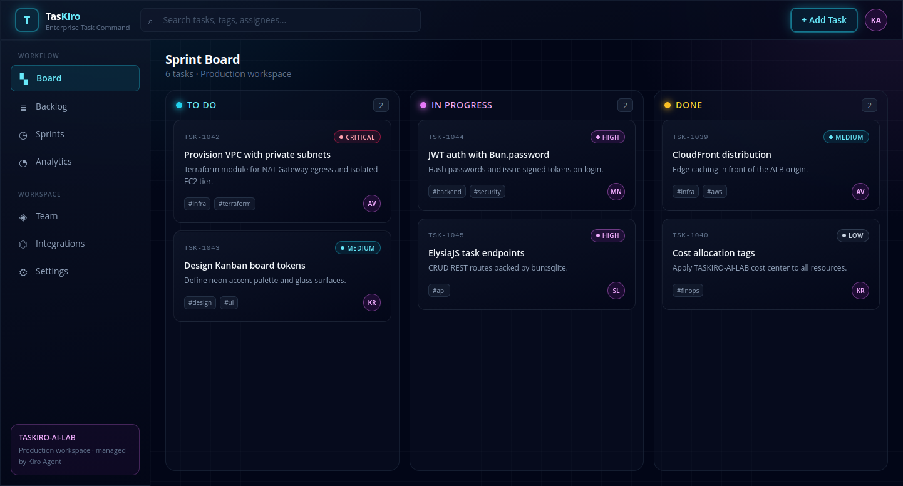
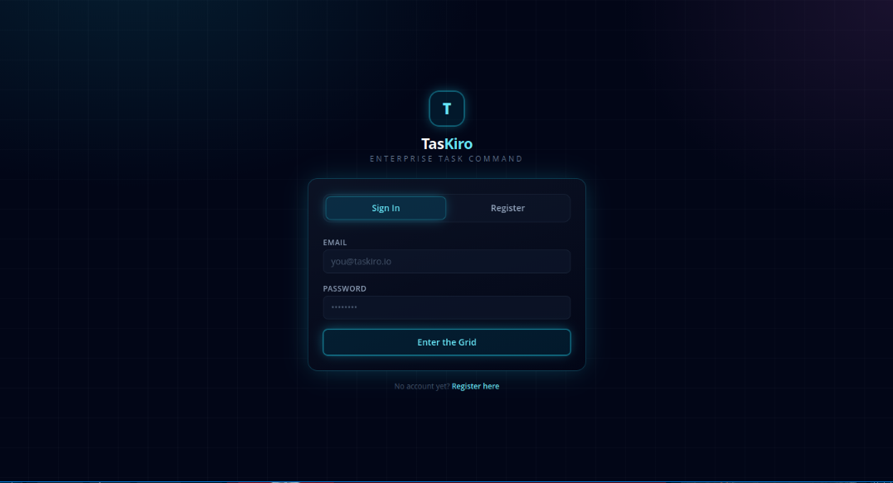
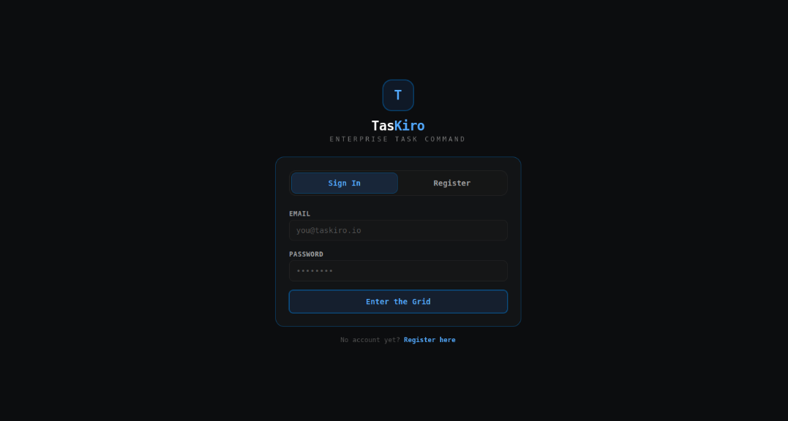
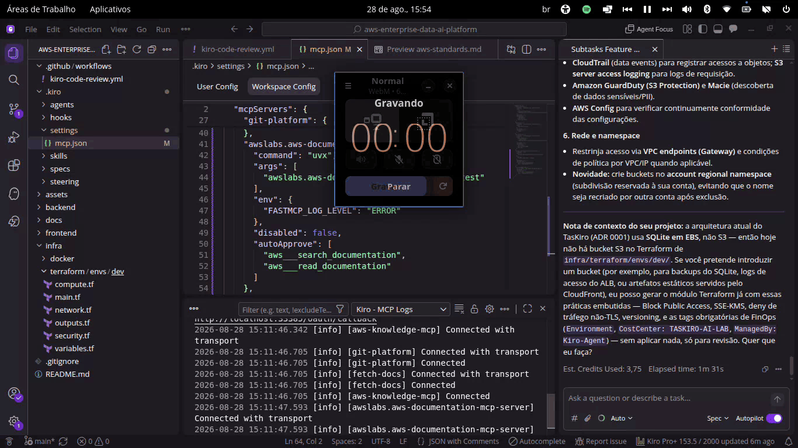
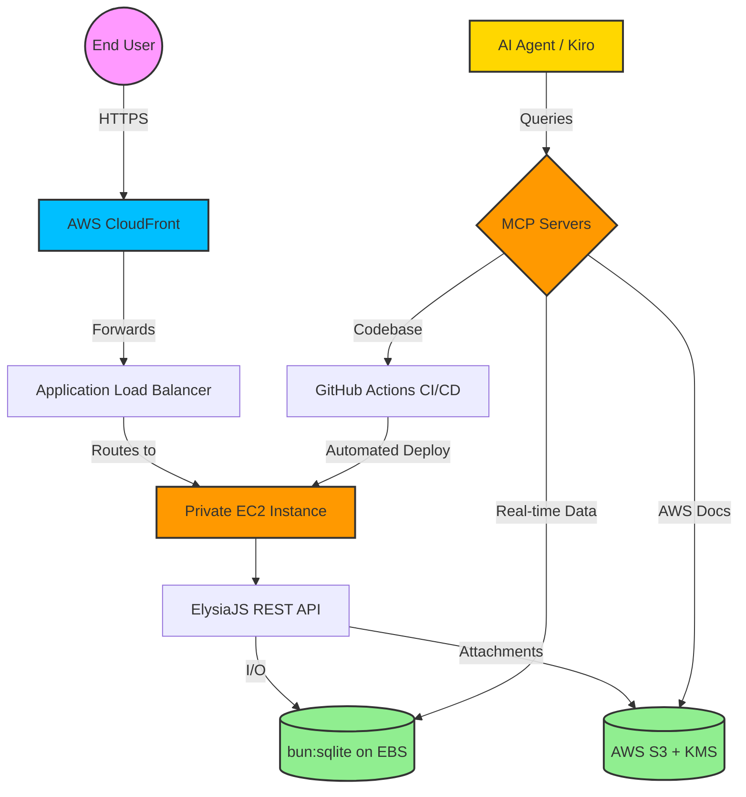

# TasKiro — AWS Enterprise AI Platform

<p align="center">
  
  
  
  
  
  
  
  
</p>

---

## 📋 Table of Contents

1. [Executive Summary](#-executive-summary)
2. [Platform Evolution & Visual Architecture](#-platform-evolution--visual-architecture)
3. [System Architecture & AI Workflow](#-system-architecture--ai-workflow)
4. [AI & Engineering Framework Deep Dive](#-ai--engineering-framework-deep-dive)
5. [Local Setup Guide](#-local-setup-guide)
6. [Directory Architecture](#-directory-architecture)
7. [CI/CD & Quality](#-cicd--quality)
8. [Architecture Decision Records](#-architecture-decision-records)
9. [GitHub Stats](#-github-stats)
10. [Professional Vision](#-professional-vision)
11. [Roadmap & Contributing](#️-roadmap--contributing)
12. [License](#-license)
13. [Contact & Collaboration](#-contact--collaboration)

---

## 🎯 Executive Summary

This repository consolidates the architecture and implementation of a full-stack task management application (**TasKiro**), orchestrated by Artificial Intelligence agents under strict enterprise governance.

This project acts as an advanced engineering laboratory, elevating a standard web application to a C-Level enterprise standard. With **over 20 years of experience** in IT infrastructure, and currently working in **Cloud Platform Engineering, Data Engineering, Artificial Intelligence, and Automation**, I developed this repository as a Proof of Concept (PoC) for scalable, AI-driven, cloud-ready systems managed under rigorous FinOps and DevSecOps governance.

### Key Highlights

- ✅ **AI Solutions Architecture:** Agent orchestration using Model Context Protocol (MCP) and custom Agent Skills.
- ✅ **High-Performance Full-Stack:** Containerless architecture utilizing Bun, React 19, ElysiaJS, and `bun:sqlite`.
- ✅ **Cloud-Ready Infrastructure:** Resilient AWS deployment design (CloudFront, ALB, Private EC2, NAT Gateway, S3 & KMS).
- ✅ **Security & Governance:** Strict IAM Least Privilege policies, Customer Managed KMS Keys, and automated FinOps tagging.

---

## 📸 Platform Evolution & Visual Architecture

Documenting the architectural journey from the initial MVP to an enterprise-grade platform, demonstrating continuous iteration, frontend UI refactoring, and autonomous IaC generation and governance.

### Phase 1: Core Functional Dashboard

*The first successful deployment of the TasKiro backend and frontend, validating core task management routing, state persistence, and the initial aesthetic.*

<p align="center">
  
</p>

### Phase 2: Design System Refactoring (Graphite UI via Agent Skills)

*Demonstrating the UI transformation. The original authentication screen (left) versus the enterprise restyling using the Graphite UI design system (right), achieved through strict Agent Skills context injection.*

<p align="center">
  
  &nbsp;&nbsp;
  
</p>

### Phase 3: Autonomous IaC Provisioning via AWS Documentation MCP Server

*Real-time demonstration of Kiro Agent leveraging the AWS Documentation MCP Server to query 2026 S3/KMS security policies and generating production-ready Terraform code.*

<p align="center">
  
</p>

### Phase 4: Agentic AI & DevSecOps — Automated S3 Provisioning & Security Audit

*End-to-end demonstration of Infrastructure as Code (IaC) mastery combined with Agentic AI governance: an AI Agent (via MCP Server) autonomously audited a Terraform-provisioned S3 Document Store against enterprise security baselines, identified environment-specific constraints (SCPs), and generated a formal Security Waiver ([ADR-0004](./docs/adr/0004-s3-document-store-lab-security-waiver.md)) — proving advanced capability in governing and maintaining audit-ready cloud infrastructure.*

<p align="center">
  
</p>

---

## 🏗️ System Architecture & AI Workflow

### Architecture Diagram



### Architecture Components

| Component | Technology | Purpose |
| --- | --- | --- |
| **Frontend Interface** | React 19 + Tailwind v4 | High-density corporate dashboard (Graphite UI design system) |
| **Backend API** | ElysiaJS (Bun) | High-throughput RESTful API operations |
| **Database** | SQLite (WAL mode) | Microsecond I/O persistent storage on AWS EBS |
| **Document Store** | AWS S3 + Dedicated KMS | Encrypted document and attachment storage with FinOps lifecycle rules |
| **AI Integration** | Model Context Protocol | Real-time database, Git repository, and official AWS documentation querying |
| **Cloud Environment** | AWS (EC2, ALB, NAT, S3) | Secure, containerless, and scalable hosting infrastructure |

---

## 🧠 AI & Engineering Framework Deep Dive

### 1. Model Context Protocol (MCP)

To overcome the limitations of static AI training data, local MCP servers (`awslabs.aws-documentation-mcp-server`, `aws-knowledge-mcp`, `mcp-server-sqlite-npx`, `mcp-server-git`, `mcp-server-fetch`) were configured. This grants the AI agent real-time capabilities to:

* Query official AWS documentation in real time for compliant architecture patterns.
* Audit database schemas and run queries natively.
* Fetch up-to-date API documentation for accurate code generation.
* Read Git unstaged diffs and commit histories.

### 2. Agent Skills & UI Design

Injected specialized design knowledge via `.kiro/skills`, applying the **Graphite UI** aesthetic:

* Strict monochrome OKLCH color palette with a single blue accent.
* Monospace typography optimized for analytical dashboards.
* Complete visual restyling decoupled from the React state and business logic.

### 3. Enterprise AI Steering & FinOps

Defined strict organizational behaviors through AI Steering documents (`.kiro/steering/`):

* **Zero Hardcoded Secrets:** Enforced environment variable usage.
* **FinOps Compliance:** Mandatory AWS resource tagging (`Environment`, `CostCenter`, `ManagedBy`) and automatic lifecycle tiering.
* **DevSecOps:** Dedicated Customer Managed KMS keys, strict IAM Least Privilege, and deployment via AWS Systems Manager (SSM).

---

## 🚀 Local Setup Guide

### Prerequisites

* [Bun](https://bun.sh/) `>= 1.1.x`
* Git

### Installation & Run

```bash
# Clone the repository
git clone https://github.com/PhilipeOliveiraS/aws-enterprise-data-ai-platform.git
cd aws-enterprise-data-ai-platform

# Install dependencies (backend and frontend)
bun install

# Copy environment variables
cp .env.example .env

# Run in development mode
bun run dev

# Build for production
bun run build
```

### Environment Variables

| Variable | Description | Required |
| --- | --- | --- |
| `DATABASE_PATH` | Path to the `bun:sqlite` database file | ✅ |
| `PORT` | Port for the ElysiaJS API server | ✅ |
| `AWS_REGION` | AWS region used by deployment scripts | ✅ |

---

## 📂 Directory Architecture

```text
aws-enterprise-data-ai-platform/
├── .github/workflows/      # Headless automation for CI/CD via AI CLI
├── .kiro/                  # AI Governance, Context, and Capabilities
│   ├── agents/             # Custom AI agents configurations
│   ├── hooks/              # Automated execution hooks for AI
│   ├── settings/           # MCP Servers configuration (mcp.json)
│   ├── skills/              # On-demand specialized knowledge (e.g., Graphite UI)
│   ├── specs/               # Technical specifications and task definitions
│   └── steering/           # Global architectural guidelines and FinOps standards
├── assets/                 # Documentation assets
│   └── screenshots/        # Project evolution images and showcase GIFs
├── backend/                # High-performance RESTful API (ElysiaJS & SQLite)
├── docs/                   # Additional documentation
│   └── adr/                # Architecture Decision Records (e.g., AI FinOps, MCP, S3)
├── frontend/                # User Interface (React, Vite, Tailwind v4)
├── infra/                   # Infrastructure as Code (IaC) and deployment scripts
│   └── terraform/          # AWS Infrastructure modules (VPC, EC2, S3, KMS)
│       └── env/
│           └── dev/        # Dev environment Terraform configuration
├── .gitignore               # Git ignore rules
└── README.md                # Central project documentation
```

---

## ✅ CI/CD & Quality

<p align="center">
  
</p>

The GitHub Actions pipeline (`kiro-code-review.yml`) automates:

* **AI-Assisted Code Review:** Automated review pass on every push, leveraging the Kiro agent.
* **Lint & Type Check:** Static analysis on every push.
* **Automated Deploy:** Headless deployment to the private EC2 instance via AWS SSM.
* **FinOps Guardrails:** Validates mandatory resource tagging before infrastructure changes are applied.

---

## 📐 Architecture Decision Records

Key decisions behind TasKiro's architecture are documented as ADRs:

* [ADR-0001 — AI Agent FinOps Governance](./docs/adr/0001-ai-agent-finops-governance.md)
* [ADR-0002 — MCP Integration & Graphite UI](./docs/adr/0002-mcp-integration-graphite-ui.md)
* [ADR-0003 — Enterprise Document Store with S3 & KMS](./docs/adr/0003-enterprise-document-store-s3-kms.md)
* [ADR-0004 — S3 Document Store Lab Security Waiver](./docs/adr/0004-s3-document-store-lab-security-waiver.md)

See the full list in [`/docs/adr`](./docs/adr).

---

## 📊 GitHub Stats

<p align="center">
  
  
</p>

<p align="center">
  
</p>

---

## 👨‍💻 Professional Vision

### Personal Statement

My approach combines over **20 years of IT experience** with modern principles in **Cloud Platform Engineering, Data Engineering, Artificial Intelligence, and Automation**. I believe that technology must be a reliable bridge to business growth, always seeking to honor the vocation and the talents entrusted to me by **God**.

### Core Principles

1. **Excellence in Execution:** Quality and security are non-negotiable in every line of code.
2. **Business Alignment:** Technology exists to serve, scale, and accelerate business objectives.
3. **Extreme Automation:** Leveraging Agentic AI and multi-agent systems to eliminate toil and optimize operations.
4. **Strategic Leadership:** Bridging the gap between complex cloud infrastructure and C-Level goals.

### Professional Background

* ✅ **20+ Years:** IT Infrastructure & Executive Management
* ✅ **Current Focus:** Cloud Platform Engineering, Data Engineering, AI, and Automation
* ✅ **Continuous Learning:** Systems Analysis and Development, FAST technology acceleration program at CESAR School, and continuous certifications.

---

## 🗺️ Roadmap & Contributing

### Next Steps

* [ ] Observability stack (structured logging + metrics dashboard)
* [ ] Multi-tenant support
* [ ] Expanded automated test coverage

### Contributing

This is currently a solo enterprise-engineering PoC, but suggestions and issues are welcome — feel free to open an [issue](https://github.com/PhilipeOliveiraS/aws-enterprise-data-ai-platform/issues) or reach out via the contact section below.

---

## 📄 License

This project is licensed under the **MIT License** — see the [LICENSE](./LICENSE) file for details.

---

## 📞 Contact & Collaboration

**Philipe Oliveira** - 📧 Email: philipeoliveira1984@gmail.com

* 💼 LinkedIn: [linkedin.com/in/philipeoliveiras](https://www.linkedin.com/in/philipeoliveiras)
* 🐙 GitHub: [github.com/PhilipeOliveiraS](https://github.com/PhilipeOliveiraS)

### Acting In:

* **Cloud Platform Engineering:** AWS Infrastructure, DevOps, FinOps
* **Data Engineering:** ETL Pipelines, Data Architecture, Analytics
* **Artificial Intelligence:** Agentic AI, Multi-Agent Systems (MCP), LLM Integrations
* **Automation:** AWS Workflows, CI/CD, Scripting

---
