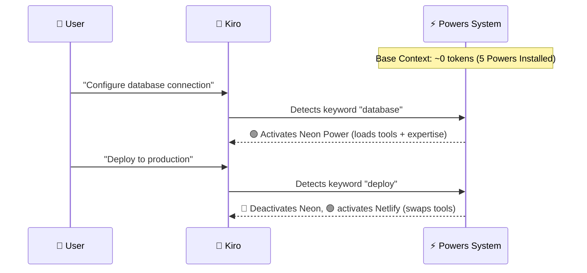

# Kiro Powers: On-Demand Expertise

## 💡 What Are Kiro Powers?

Kiro Powers are unified packages that combine MCP tools, framework expertise, and workflow guides into a single installable unit. They provide dynamic, on-demand access to specialized knowledge, making it easier to work with unfamiliar technologies and tools.

Think of Powers as **"skill packages"** for your AI agent — install a Power and Kiro instantly gains expertise in that technology.

---

## 🛑 The Problem Powers Solve

Traditional AI-assisted development using multiple MCP servers runs into **context window limitations**:

* Connect five MCP servers and your agent loads 100+ tool definitions before writing a single line of code.
* Five servers can consume **50,000+ tokens** (roughly 40% of your context window) before your very first prompt.
* This leads to slower responses, loss of focus (hallucination), and lower output quality.

---

## ⚡ How Powers Solve This

Powers use **dynamic context loading**. Instead of loading everything at once, tools are activated only when needed.

* Install five Powers and your base context consumption stays close to zero.
* Mention "database" and the relevant Power activates, loading its tools and expertise.
* Switch topics and the previous Power deactivates while the new one loads.
* **Your agent only loads tools relevant to the current task.**

---

## 🧩 Anatomy of a Power

A Power is a structured package that includes:

| Component | Description |
| --- | --- |
| `POWER.md` | Entry steering file — tells the agent which tools are available and when to use them. |
| **MCP Server Config** | Tools and connection details for the MCP server. |
| **Steering Files** | Workflow guides and best-practice documentation. |
| **Hooks (Optional)** | Automation triggers for event-driven workflows. |

---

## 🎯 Power Activation

Powers activate automatically based on keywords in your conversation:

| You mention... | Power that activates |
| --- | --- |
| *"payment"* or *"checkout"* | Stripe |
| *"database"* or *"postgres"* | Supabase / Neon |
| *"deployment"* or *"hosting"* | Netlify |
| *"infrastructure"* or *"terraform"* | Terraform |
| *"agents"* or *"AI"* | Strands Agents |

---

## ⚖️ Powers vs Manual MCP Configuration

| Feature | Manual MCP Configuration | Kiro Powers |
| --- | --- | --- |
| **Loading** | Loads all tools at once | Loads tools on demand |
| **Knowledge** | No built-in framework expertise | Integrated best practices |
| **Setup** | Manual JSON configuration | One-click installation |
| **Consumption** | Static (permanent) context usage | Dynamic (rotating) activation |
| **Workflow** | No workflow guides | Integrated steering files |

### When to Use Each

Both approaches have their place. Manual MCP is best for temporary custom servers or when you need absolute control. Powers are ideal for common frameworks with established patterns, or for standardizing knowledge across an entire team.

---

## 🏢 Powers in Enterprise Environments

For platform engineering and enterprise teams, Powers provide:

1. **Shared Knowledge:** Package your team's expertise (proprietary APIs, internal CI/CD) into custom Powers.
2. **Consistent Standards:** Everyone in the company follows the same DevSecOps standards and practices.
3. **Faster Onboarding:** New engineers gain instant access to internal tools by simply installing the team's Power.
4. **Centralized Updates:** Update a Power once, everyone benefits automatically.

---

## ⚙️ Managing Powers

* **Installing from the Panel:** Browse Kiro's side panel, search by keyword, and click *Install*. Kiro automatically registers the server in `~/.kiro/settings/mcp.json`.
* **Importing Powers:** You can import Powers from **GitHub URLs** or **local directories**, making it easy to distribute internal rules securely without exposing data publicly.
* **Cross-Tool Compatibility (Coming Soon):** The vision is to build a Power once and use it across the Kiro IDE, Kiro CLI, Cline, Cursor, etc., consolidating the *Model Context Protocol* as the universal standard for AI tooling.
